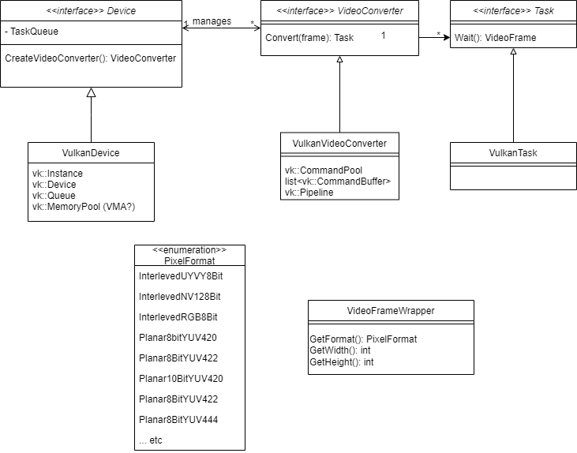
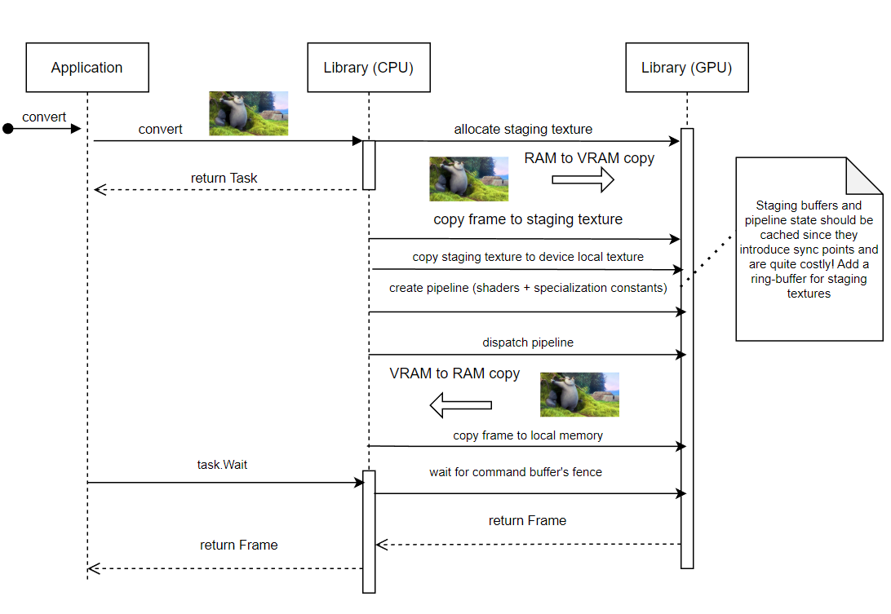

# PixelWeave

## Setup
1. Install:
   1.  [`CMake  3.19.2`](https://cmake.org/download/) or later.
   2.  [`Vulkan SDK 1.3.224.1`](https://vulkan.lunarg.com/sdk/home) or later.
       -   On Windows, be sure to set up the `VULKAN_SDK` environment variable.
       -   On MacOS, run  `sudo ./install_vulkan.py` to setup your environment.
   3.  `Visual Studio 2022` and `C++ tools` or `XCode` depending on your platform.
2.  Create a `build` folder and run:
    a. Windows: `cmake .. -G Visual Studio 17 2022`
    b. MacOS: `cmake .. -G Xcode`
3. Open your IDE of choice. You'll see two projects:
   1. `PixelWeave`: The main library project. Compiling it generates the distributable `.dll` or `Framework`.
   2. `Tests`: A set of helper functions that can aide in quick testing while developing (don't rely on them, though).
4. Run `Tests` to check your environment was correctly set up.

## Library

#### Overview
<p align="center">
    
</p>


#### POC architecture (subject to change)

- `Device` will be responsible of handling all global resources (video memory, command pools, video device picking, command queue management, etc).

- `VideoConverter` will manage a single video conversion stream (for example, converting all frames coming from an NDI stream, file stream, etc). Ideally isn’t shared, because it will cache some resources so it runs faster when used with the same parameters.

- `Task` a wrapper around internal sync primitives. Allows applications to wait for results and do things while it’s not done (e.g. process audio). **Currently, the converter works synchronously, which means the GPU processes a single frame at a time**

- `VideoFrameWrapper` is based on our webrtc needs, and is inspired by its internal structure.

#### Frame life-cycle
<p align="center">
    
</p>


## Usage

After linking the binaries for your platform, you should be able to use PixelWeave as shown below:
```cpp
auto [result, device] = PixelWeave::Device::Create();
if (result == PixelWeave::Result::Success) {
    // Generate wrapper around source frame buffer
    auto srcBuffer = PixelWeave::VideoFrameWrapper{ 
        srcBuffer,
        bytesPerLine,
        srcWidth,
        srcHeight,
        PixelWeave::PixelFormat::Interleaved8BitUYVY};

    // Generate wrapper around dst frame buffer (application controls allocation)
    auto dstBuffer = PixelWeave::VideoFrameWrapper{
        dstBuffer,
        dstStride,
        dstWidth,
        dstHeight,
        PixelWeave::PixelFormat::Planar8Bit444};

    // Create converter and call
    PixelWeave::VideoConverter* videoConverter = videoConversionDevice->CreateVideoConverter();
    videoConverter->Convert(srcBuffer, dstBuffer);

    // Release both converter and device
    videoConverter->Release();
    device->Release();
}

```
